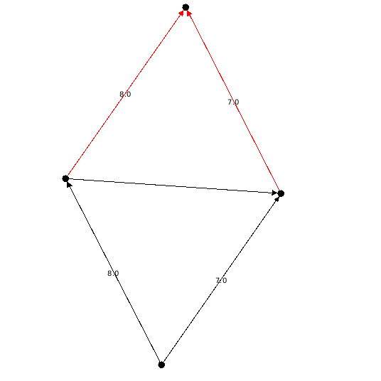
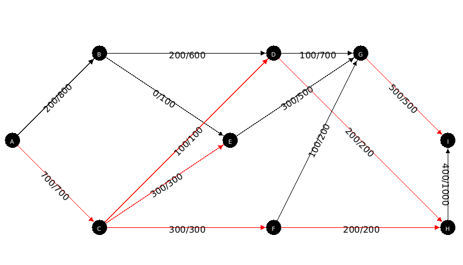
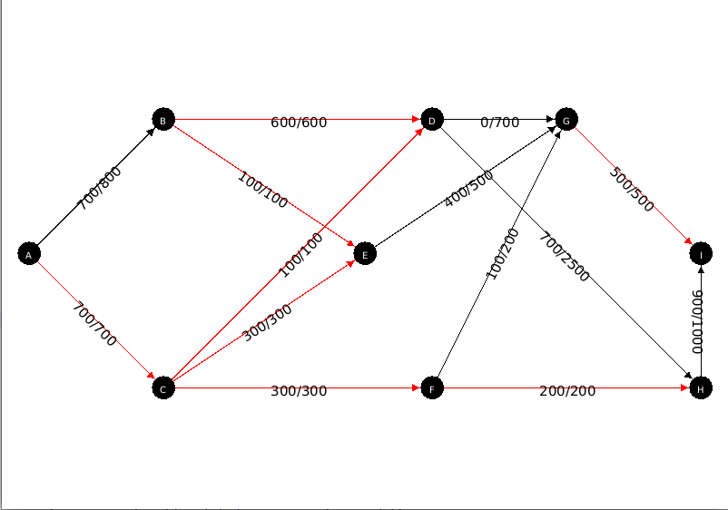
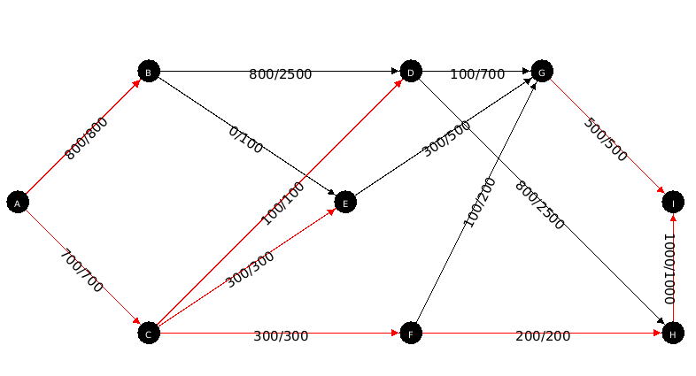

# Rapport de TP - Ri

|Année|Filière|Matière|TP|Sujet |Auteur 1|Auteur 2|
|--|--|--|--|--|--|--|
| 2021-2022 | M1 IWOCS | RI |Tp Flot | Flot Maximum | Ait Hammi Massinissa|Ghita El-Hachami|


## Plan

* [Flot maximum tp](#flot-maximum-tp)
   * [Le problème de l’autoroute ](#problème)
      * [Préambule](#préambule)
      * [Construire le graphe associé au réseau routier et le mettre sous forme d'un fichier dgs](#question1)
      * [Donnez la solution du problème de flot max en utilisant l'algorithme mis à votre disposition. Vous afficherez le réseau, les valeurs du flot sur les arêtes, et vous mettrez en évidence les arêtes saturées](#question2)
      * [ AVANT de tester toutes les solutions pour la question 2), que pouvez-vous déduire du flot max sur le réseau routier ?](#question3)
      * [Donnez les flots successifs en justifiant qu'il s'agit bien à chaque fois du tronçon qui augmente le plus la valeur courante du flot. Commentez.](#question4)
      * [Code source utilisé pour les calcules et l'affichage ](#question5)
      * [Conclusion](#question6)
    
    


# Flot Maximum #

<div id="probleme" align="center">
</div>
### Le problème de l'autoroute ###

Neuf villes A,B,C,...,I sont reliées entre elles par le réseau routier qui se trouve dans cette image

 [Graph](src/main/resources/graph.png)

 Afin d'accroire le trafic routier entre les extrémités du réseau , un projet de construction d'une autoroute est étudié. On a évalué pour chaque route le nombre maximal de véhicule par heure qu'elle peut écouler compte tenue de certaines données , ces évaluations sont données par les nombres entre parenthèses sur le réseau .


<div id="preambule" align="center">
</div>

### Préambule ###

Récupérer sur Eureka l'archive maxflow. Elle contient le code d'un algorithme de flot max et
celui du test de cet algorithme sur un exemple. Testez ce code, si besoin modifiez-le pour
qu'il soit compatible avec GS2.0. Vérifiez son fonctionnement : observez la construction du
graphe dans GS, Résolvez le problème de flot max et vérifiez à la main la solution obtenue.
Testez avec un second exemple (du cours ou construit par vous)

***Réalisation***
- Modification des classes dans le dossier MaxFlow/  fichier [MaxFlow](src/main/java/maxflow/MaxFlow.java) pour qu'il fonctionne avec la version 2.0 de graphstream.
- Tester le programme
- Résultat 

> 

<div id="question1" align="center">
</div>

### Construire le graphe associé au réseau routier et le mettre sous forme d'un fichier dgs ###

   - Résultat

> [Fichier  ficier.dgs](src/main/resources/fichier.dgs)


<div id="question2" align="center">
</div>


### Donnez la solution du problème de flot max en utilisant l'algorithme mis à votre disposition. Vous afficherez le réseau, les valeurs du flot sur les arêtes, et vous mettrez en évidence les arêtes saturées ###

- Résultat

   

   <div id="question3" align="center">
</div>

### AVANT de tester toutes les solutions pour la question 2), que pouvez-vous déduire du flot max sur le réseau routier ? ###

   D'après le schéma ci dessus, on peut  déduire que le flot n'est pas optimal car le flotmax avec les capacités actuelles nous donne uniquement 900 à l'arrivée, cela peut s'expliquer par le faite que :

   - L'arête [AB] n'est qu'à 40% de sa capacité, et toutes les arêtes qui partent de C ne sont pas suffisamment dimensionnées pour transmettre efficacement le flux disponible depuis la source A.
   - La capacité de la source A n'est atteinte qu'à 50% tandis que la capacité du puit I n'est que d'environ 60% 

   ***En conclusion***, il n'y a donc que la moitié du flot disponible dans ce réseau routier qui est transmis de A vers I.

   ***Pour arranger ça*** on peut augmenter les capacités de certains arcs et ainsi augmenter le flotmax pour enfin avoir un flot optimal.

   ***Remarque***  Le Flot que l'on obtient est maximum car on peut voir que les nœuds H et I sont isolés du reste (aucune arête les rejoint) donc pas de chemin entre A et I 

   <div id="question4" align="center">
</div>

### Donnez les flots successifs en justifiant qu'il s'agit bien à chaque fois du tronçon qui augmente le plus la valeur courante du flot. Commentez. ###

   Dans un premier temps,les flot de [AC] [DH] [GI] sont  saturé. donc l'augmentation du flot ne peut pas passer entre [HI]. Notre réseau est toujours avec un flot max de 900.

-Coupe minimale du graphe d'origine


   En revanche, on remarque également que les segments [AB], [BD], [DG] sont très peu exploités du fait de la faible capacité de [DH]; Donc si nous augmentons la capacité de cette arête, nous pourrons  et ainsi passer d'un flot max avant travaux de 900 voitures à l’heure, à un nouveau flot max de 1400 voitures :

- Coupe minimale après 1 itération


```java
   Meilleur avantage à améliorer: DH[D->H]
   Flux arrivant à sink : 1400
```



  on profitant d'avantage des arrêtes avec une meilleur capacité et en faisant une deuxième itération nous pourrons optimiser encore d'avantage la circulation et ainsi passer d'un flot max de 1400 voitures à l’heure, à un nouveau flot max de 1500 voitures :

- Coupe minimale après 2 itération

```java
Meilleur avantage à améliorer: BD[B->D]
Flux arrivant à sink : 1500
```



<div id="question5" align="center">
</div>

### Code source utilisé pour les calcule et l'affichage 

> [Fichier  CreationAutoroute.java](src/main/java/CreationAutoroute.java)


<div id="question6" align="center">
</div> 

### Conclusion :

- Les coupes minimales passe par des arêtes saturées
- Les unités de flot de la source vers la destination (A -> I) passent par au moins une arête saturée.


   >Finalement, en augmentant la capacité de quelque arêtes puis on faisant la somme de leurs capacités , nous avons réussi à atteindre la capacité optimale du puit I avec un flot de 1500 voiture/heure.


